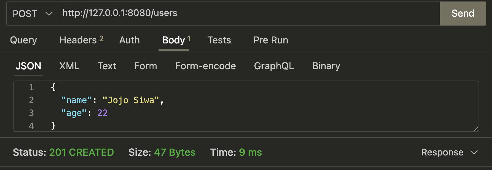

# Intro to Backend: API's + Flask
In this part of the workshop, set up your own Flask server and integrate it with your React front end from the previous workshop.

## Simple API call example
simple.py contains a very basic GET request with a fake API (https://jsonplaceholder.typicode.com/). This is not a part of the project, but for you to understand a simple example where the client is our Python code requesting data from a resource.

## Flask Demo Setup
Make sure to have Python installed (https://www.python.org/downloads/). You can verify you have it installed by checking your versions of Python and pip.

On Linux and macOS
```
python3 --version
pip3 --version
```
On Windows
```
python --version
pip --version
```

We are continuing from where we left off with our React frontend (but you don't necessarily need it to implement your backend. First begin by creating a folder for your front end and backend. Move into your backend directory. You should have the following file structure:

```
cd backend
```
Now time to create a virtual environment. Why do we need one? Short answer: it's cleaner. It helps to create isolated, project-specific sandboxes, preventing package version conflicts and protecting your system's global Python installation.

On Linux and macOS
```
python3 -m venv .venv
```
On Windows
```
python -m venv .venv
```
To activate it
```
source .venv/bin/activate
```
When you activate it you should see (venv)
To deactivate it
```
deactivate
```

Great now you should see (.venv) in front of your terminal prompt.
*** !! IMPORTANT NOTE !! Your .venv needs to go in your .gitignore file as such:
```
# Python virtual environment
venv/
.venv/
```
You should not commit this to GitHub. A virtual environment contains paths specific to the computer on which it was created (e.g., hardcoded paths to the Python interpreter on your machine). If you clone the repository on another system, these paths will likely be different, causing the environment to fail.

Create another folder called src in your backend folder (NOT in your .venv folder). Create a file called app.py in this folder. You should have the following file structure.

```
.
├── frontend
    ├── crud_app            # name of my React Project
      └── ...
├── backend                    
│   ├── .venv               # contains virtual environment
│   ├── src         
│     └── app.py                

```
Now that your venv is activated, you'll want to install Flask.

On Linux and macOS
```
pip3 install flask
```
On Windows 
```
pip install flask
```

## Writing the CRUD app with Flask
Congrats your setup is complete! Now time to write our Flask backend! Our backend will serve our client, our React front end. We will write our own API, define our own endpoints, and controll our own data. Let's familiarize ourselves with the different HTTP Methods to help us Create, Read, Update, and Delete (POST, GET, PUT, DELETE). 

### Basic Flask Setup
```
from flask import Flask, jsonify, request, send_from_directory

app = Flask(__name__, static_folder="../../frontend/crud_app/dist", static_url_path="/")

if __name__ == "__main__":
    app.run(port=8080,debug=True)
```
This file initializes a basic Flask application and starts a local development server.

* Flask(__name__) creates the Flask app instance.
* static_folder and static_url_path configure Flask to serve a frontend build as static files.
* The app runs locally on port 8080 with debug mode enabled for development.

### Defining our fake data
To keep things simple, we will define a simple JSON array representing our data in our file. In real projects we would instead query a database.
```
users = [
    {"id": 1, "name": "John Pork", "age": 67},
    {"id": 2, "name": "Cynthia Erivo", "age": 40},
]
```

### Defining Routes
```
# method to get all users
@app.route("/users", methods=["GET"]) 
    def get_users(): 
        return jsonify(users)
```
* This code defines a simple API endpoint. 
* @app.route("/users", methods=["GET"]) specifies the URL path and HTTP method.
* get_users() is the function that runs when the route is accessed. 
* The function returns user data as JSON.
* Accessing /users sends back a list of users.

The rest of the routes should follow a similar formula (refer to the complete app.py file)

### Launch your server
```
python ./src/app.py
```
### Testing APIs
You can use Postman or any other tool you want to test your API's. VS code has a great extension called Thunder Client to do this.
*** Note for POST and PUT requests you need to specify a body in your request with your new user data ***


### Serving Front End on Flask Server
First create a build of your react app (different from your source code).
```
npm run build
```
This will create a folder in your React project called dist. You'll need the path of this file for later. These line will take care of serving your front end.
```
app = Flask(__name__, static_folder="../../frontend/crud_app/dist", static_url_path="/")

# for serving front end
@app.route("/")
def home():
    return send_from_directory(app.static_folder, "index.html")
    # ../frontend/crud_app/dist/index.html
```
Add the following front end API call to your Counter.jsx (refer to full file)
```
  // fetch users: api call to flask server
  const [users, setUsers] = useState([]);

  useEffect(() => {
    fetch("http://127.0.0.1:8080/users") // your Flask API
      .then((res) => res.json())
      .then(setUsers)
      .catch((err) => console.error("Failed to fetch users:", err));
  }, []);
  
  return (
    ...

      {/* Simple users display */}
      <div style={{ marginTop: "32px", textAlign: "center" }}>
        <h2>Users from API</h2>
        <ul>
          {users.map((user) => (
            <li key={user.id}>
              {user.name} ({user.age} years old)
            </li>
          ))}
        </ul>
      </div>
    </div>
  );
```
Ba da bing ba da boom! Front end served! Enjoy your CRUD app!

#### Keep in Mind + Next Steps
* We used simple data locally in our file. This would be replaced with querying a database for a real project
* Development settings (like debug=True and open CORS) should be disabled or restricted in production.
* APIs should include authentication and authorization before exposing real data. Ex. API keys, tokens, or login-based access so only approved users can call certain endpoints (Use environment variables for secrets and configuration → never hardcode keys or passwords).
* Add basic error handling so the API fails safely
* Keep venv in .gitignore
